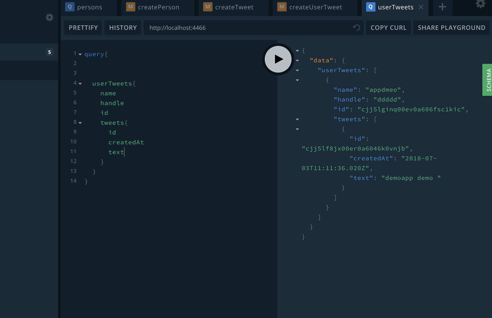
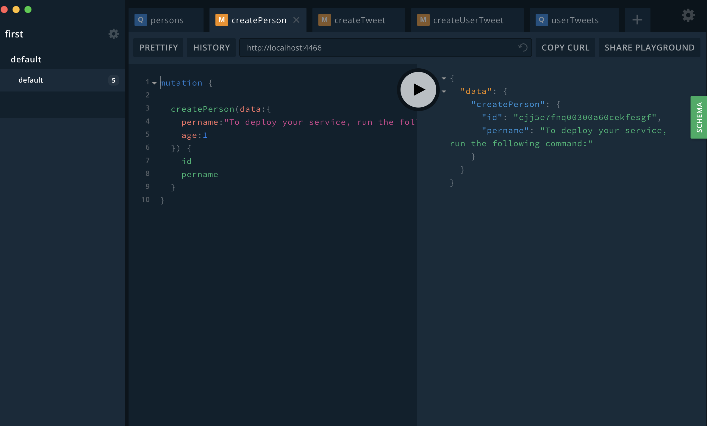
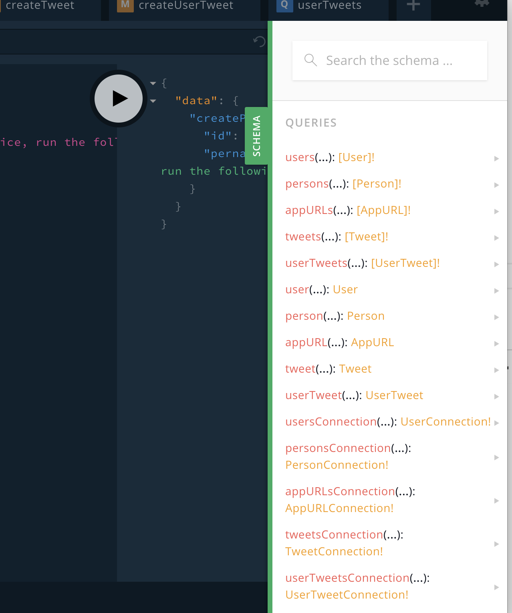

# prisma docker-compose demo project

## install prisma

```code

npm install -g prisma

or

yarn global add prisma

```

## How to Run

```code
docker-compose up -d
```

## deploy schema

```code
prisma deploy
```

## open broswer or use playground

```code
open http://localhost:4466

or  

prisma playground

```

## some images



